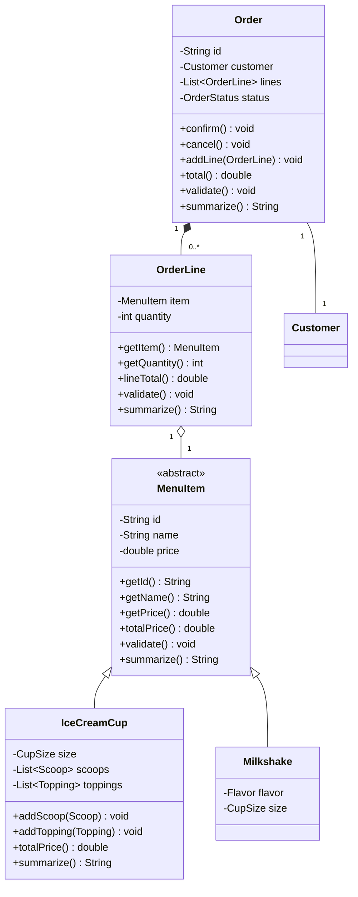

# Ice Cream Shop CLI (Java OOP)

This console app manages an ice cream shop focusing on order intake. It demonstrates core OOP and collections concepts:

- Array: repositories return arrays (T[]) and Order exposes `linesArray()`; arrays are used for simple copies/outputs.
- Inheritance: abstract `MenuItem` with concrete subclasses `IceCreamCup` and `Milkshake`.
- Polymorphism: the `summarize()` and `totalPrice()` methods are invoked via `MenuItem` and run the concrete implementation.
- Menu with `Scanner`: interactive console menu in `Main` for customers and orders.
- Abstract class: `MenuItem` centralizes common fields and validation.
- Repository and ArrayList: in-memory repositories (`InMemoryCustomerRepository`, `InMemoryOrderRepository`) backed by `ArrayList`, exposed via the `Repository<T>` interface.
- Exceptions: custom checked exceptions (`ValidationException`, `DuplicateException`, `NotFoundException`).
- Interfaces and validations: `Identifiable`, `Summarizable`, `Validatable`, and comprehensive domain validations.
- Dependency injection via interfaces: `Main` depends on `Repository<Customer>` and `Repository<Order>`, not on concrete classes.
- Relationships: composition (Order -> OrderLine, IceCreamCup -> Scoop), aggregation (IceCreamCup -> Topping), association (Order -> Customer, OrderLine -> MenuItem).

## Domain Model (key types)

- `MenuItem` (abstract): id, name, price; validates common constraints; provides `totalPrice()`.
  - `IceCreamCup`: has `CupSize`, a composed list of `Scoop` (each with a `Flavor`), and an aggregated list of `Topping`. `totalPrice()` adds 0.5 per topping.
  - `Milkshake`: `Flavor` and `CupSize`.
- `Customer`: basic info and validations.
- `Order`: associated `Customer`, composed `OrderLine` list (each line has a `MenuItem` and a quantity), `OrderStatus` lifecycle, total calculation and validations.
- Enums: `Flavor`, `Topping`, `CupSize`, `OrderStatus`.

## Project Structure

- `org.example.domain`: entities, abstract base class, enums and interfaces.
- `org.example.repo`: `Repository<T>` interface + in-memory implementations using `ArrayList`.
- `org.example.exceptions`: custom exceptions.
- `org.example.Main`: CLI with menu for customers and orders.

Note: Legacy library classes (`Publication`, `Book`, etc.) remain in the codebase only for reference of the original exercise and are not used by the new CLI.

## How to Run (no Maven required)

Requires Java 25 (or newer) available as `javac` and `java` on your PATH.

```bash
# Compile
mkdir -p target/classes
javac -d target/classes $(find src/main/java -name "*.java")

# Run
java -cp target/classes org.example.Main
```

Example interactive session (inputs on the left):

```
1        # Customers menu
1        # Add customer
C1
Alice
+5491112345678
0        # Back
2        # Create order
1        # Choose existing customer
1        # Customer #1 (Alice)
1        # Add ice cream cup
CUP1
Copa clásica
2        # MEDIUM size
2        # Scoops (1-2)
1        # VANILLA
2        # CHOCOLATE
s        # add toppings?
1        # CHOCOLATE_CHIPS
n        # add another?
2        # Add milkshake
MS1
Choco Shake
3        # LARGE size
2        # CHOCOLATE flavor
1        # quantity
0        # finish lines
3        # List orders
0        # Exit
```

## Notes

- If accented characters appear incorrectly, ensure your terminal uses UTF-8 or run with `-Dfile.encoding=UTF-8`.
- You can swap repositories thanks to the `Repository<T>` interface. For example, a fixed-array implementation could be added easily for teaching purposes.


